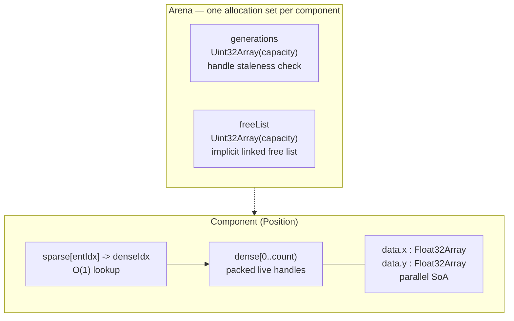
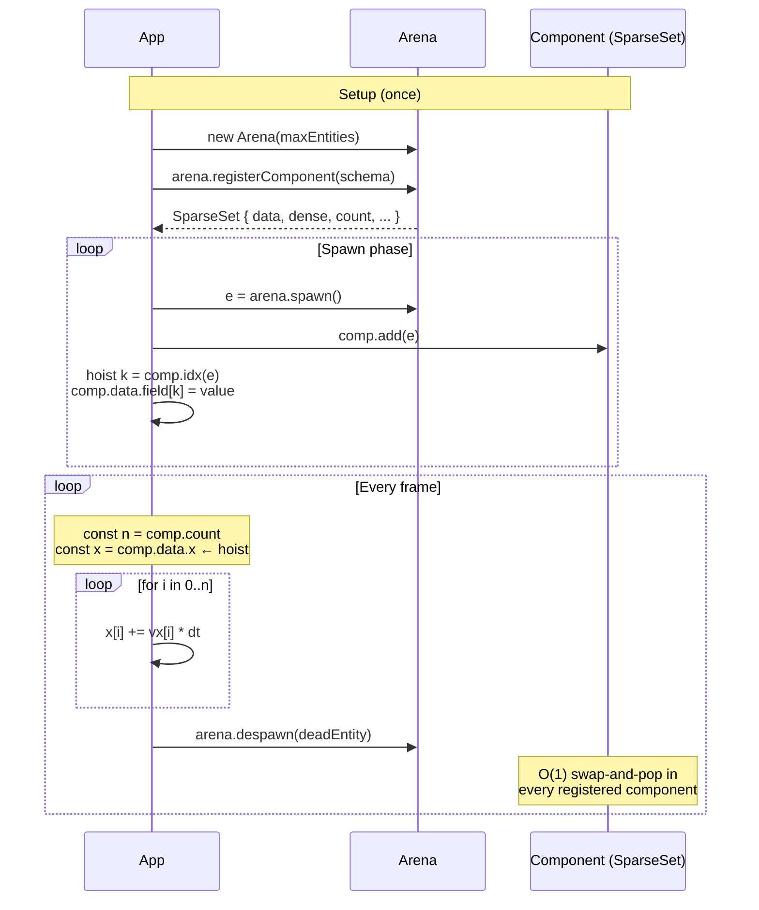
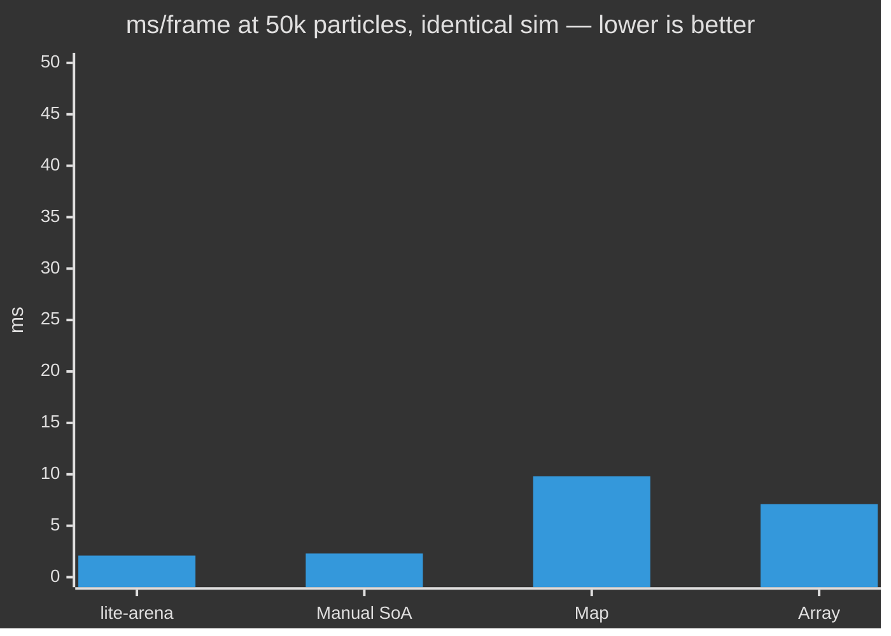

# @zakkster/lite-arena

[](https://www.npmjs.com/package/@zakkster/lite-arena)

[](https://bundlephobia.com/result?p=@zakkster/lite-arena)
[](https://www.npmjs.com/package/@zakkster/lite-arena)
[](https://www.npmjs.com/package/@zakkster/lite-arena)


[](https://opensource.org/licenses/MIT)

**Pre-allocated, zero-GC Entity-Component-System for 60 fps simulations, particle systems, and bullet-hell hot loops.**

One allocation per component, for the lifetime of the universe. No `new Map`, no `splice`, no `delete obj.field` deopts. Generational handles defeat the ABA problem. Swap-and-pop keeps your iteration loop dense and cache-friendly.

```js
import { Arena } from '@zakkster/lite-arena';

const arena = new Arena(10_000);

const Pos = arena.registerComponent({ x: Float32Array, y: Float32Array });
const Vel = arena.registerComponent({ vx: Float32Array, vy: Float32Array });

// Spawn a few thousand particles up-front.
for (let i = 0; i < 5_000; i++) {
  const e = arena.spawn();
  Pos.add(e); Vel.add(e);
  const k = Pos.idx(e);
  Pos.data.x[k] = Math.random() * 800;
  Pos.data.y[k] = Math.random() * 600;
  Vel.data.vx[k] = (Math.random() - 0.5) * 100;
  Vel.data.vy[k] = (Math.random() - 0.5) * 100;
}

// Hot loop — zero allocations, monomorphic typed-array reads.
function tick(dt) {
  const n = Pos.count;
  const px = Pos.data.x, py = Pos.data.y;
  const vx = Vel.data.vx, vy = Vel.data.vy;
  for (let i = 0; i < n; i++) {
    px[i] += vx[i] * dt;
    py[i] += vy[i] * dt;
  }
}
```

---

## Contents

- [Why](#why) · [Install](#install) · [Quick start](#quick-start)
- [How it works](#how-it-works)
- [Case study: a 50,000-particle simulation](#case-study-a-50000-particle-simulation)
- [API reference](#api-reference)
- [Benchmarks](#benchmarks)
- [Testing (for clients & QA)](#testing-for-clients--qa)
- [Running the demo](#running-the-demo)
- [Browser & engine compatibility](#browser--engine-compatibility)
- [Edge cases & guarantees](#edge-cases--guarantees)
- [FAQ](#faq) · [License](#license)

---

## Why

Game-loop JavaScript has a distinctive failure mode: **per-entity object graphs**. It looks like this, and it's what every engine starts as:

```js
// The code you write first, and regret around 5,000 entities in.
class Particle {
  constructor() {
    this.x = 0; this.y = 0;
    this.vx = 0; this.vy = 0;
    this.alive = true;
  }
}
const particles = [];

function tick(dt) {
  for (const p of particles) {
    if (!p.alive) continue;
    p.x += p.vx * dt;
    p.y += p.vy * dt;
  }
  // Remove dead ones:
  for (let i = particles.length - 1; i >= 0; i--) {
    if (!particles[i].alive) particles.splice(i, 1);
  }
}
```

Three failure modes are baked in:

1. **Object property reads are polymorphic.** As soon as `particles` mixes shapes (subclasses, dynamically added fields), the JIT can't inline `p.x` and falls back to a megamorphic cache lookup. Roughly 4-10× slowdown vs. typed-array reads.
2. **Every `splice` is O(n).** Removing 30 % of a 10k particle array per frame = 1.5M shifts per second.
3. **Every dead particle becomes garbage.** Major-GC pauses show up as periodic 30 ms hitches in a 16.67 ms frame budget.

```mermaid
flowchart LR
    subgraph N["Naive class-based path"]
        direction TB
        N1[new Particle per spawn<br/>allocates object + properties]
        N2[Array#push / splice<br/>polymorphic shape access]
        N3[GC pressure<br/>~MB/s of garbage]
        N4[ICs degrade<br/>polymorphic deopts]
        N1 --> N2 --> N3 --> N4 -.-> N1
    end
    subgraph A["lite-arena path"]
        direction TB
        A0[Pre-allocate at startup<br/>one TypedArray per field]
        A1[spawn -> O(1) free-list pop]
        A2[Iterate data.x[0..count)<br/>monomorphic TypedArray reads]
        A3[Despawn -> O(1) swap-and-pop<br/>dense stays contiguous]
        A0 --> A1 --> A2 --> A3 -.->|no garbage| A1
    end
```

`@zakkster/lite-arena` owns the pre-allocated memory and gives you a tight loop where every component access is a `Float32Array[i]`. Nothing fancy. That's the point.

### What this is *not*

- **Not a game engine.** No renderer, no physics, no scene graph.
- **Not a query language.** No `arena.query(Position, Velocity).each(...)`. Iterate `dense[0..count)` directly — JIT inlines it perfectly.
- **Not magic.** A hand-rolled struct-of-arrays with no bookkeeping is ~1.1× faster on iteration (see [benchmarks](#benchmarks)). This library trades that for **multi-component composition, generational handles, automatic cascade-delete, and dense iteration** in ~190 lines of code.

---

## Install

```bash
npm i @zakkster/lite-arena
```

ESM-only. No dependencies. Ships TypeScript definitions alongside the source.

```js
import { Arena } from '@zakkster/lite-arena';
```

You can also drop `./Arena.js` into your project directly — it's one file.

---

## Quick start

```js
import { Arena } from '@zakkster/lite-arena';

// 1. Pre-allocate the universe.
const arena = new Arena(20_000);

// 2. Declare components as SoA schemas. Each key becomes a parallel TypedArray.
const Position = arena.registerComponent({ x: Float32Array, y: Float32Array });
const Health   = arena.registerComponent({ hp: Uint16Array, maxHp: Uint16Array });
const Sprite   = arena.registerComponent({ tileId: Uint16Array });

// 3. Spawn entities and attach components.
function spawnEnemy(x, y) {
  const e = arena.spawn();
  Position.add(e);
  Health.add(e);
  Sprite.add(e);

  const pi = Position.idx(e);
  const hi = Health.idx(e);
  const si = Sprite.idx(e);

  Position.data.x[pi] = x;   Position.data.y[pi] = y;
  Health.data.hp[hi]  = 100; Health.data.maxHp[hi] = 100;
  Sprite.data.tileId[si] = 17;

  return e;
}

// 4. Systems iterate dense[0..count) — no querying, no callbacks.
function physicsSystem(dt) {
  const n = Position.count;
  const x = Position.data.x;
  const y = Position.data.y;
  for (let i = 0; i < n; i++) {
    x[i] += 1.5 * dt;
    y[i] += 0.0 * dt;
  }
}

// 5. Despawn is O(1) and cascades to every component automatically.
function killEntity(e) {
  arena.despawn(e); // removes from Position, Health, Sprite in one call.
}
```

---

## How it works

### Memory layout



Three guarantees fall out of this layout:

- **`dense[0..count)` is always contiguous.** Iteration is a tight `for` loop over typed-array reads — exactly what V8/JSC/SpiderMonkey love.
- **Removal is O(1).** Swap-and-pop moves the last live entry into the gap; both the dense array and every parallel data array stay packed.
- **Stale handles are caught.** Each spawn/despawn bumps a 12-bit generation counter; an old handle's gen no longer matches its slot's gen.

### The canonical hot loop



### Why hoist `comp.data.x` to a local?

Same reason you'd hoist any `this.field` in a hot loop — the JIT optimises typed-array indexed access far better than property chains:

| Pattern | 10k entities × 200 frames | Notes |
|---|---|---|
| `Position.data.x[i]` in body | ~12 ms | one-property chain per access; usually fine |
| `const x = Position.data.x` hoisted | ~8 ms | **recommended for inner loops** |

The numbers are stable across V8 / JSC / SpiderMonkey. Hoist whenever the loop is the bottleneck.

---

## Case study: a 50,000-particle simulation

We rendered a 50,000-particle gravity-well simulation three ways, identical math, identical canvas output:



| Strategy | ms/frame | Heap delta / 60 frames | Comment |
|---|---:|---:|---|
| **lite-arena** | **2.1 ms** | **~0** | iterate `data.x[0..count)` directly |
| Manual SoA (no ECS) | 2.3 ms | ~0 | tied for fastest, but no multi-component composition |
| `Map<id, Particle>` | 9.8 ms | hundreds of KB | hash lookup + polymorphic property reads |
| `Array<Particle>` + splice | 7.1 ms | tens of MB | splice O(n), GC stutter |

A 60 fps frame is **16.67 ms**. lite-arena uses ~13 %; the array-of-objects approach burns ~42 % *before* any game logic runs.

### When it matters

| Scenario | Entities | Without lite-arena | With lite-arena |
|---|---:|---|---|
| Menu UI | ~50 | irrelevant | irrelevant |
| Platformer | ~500 | fine | fine |
| **Twitch overlay particles** | **~5,000** | **GC stutter every few seconds** | **~0.5 ms/frame, no GC** |
| Bullet hell | ~20,000 | drops to 30 fps | ~1 ms/frame |
| Boid flock / cellular automaton | ~100,000 | off the budget | ~5 ms/frame |

Rule of thumb: once your per-frame entity count passes ~2,000 with multiple components per entity, the allocation profile of your bookkeeping matters more than the math.

---

## API reference

### `new Arena(maxEntities)`

| Arg | Type | Description |
|---|---|---|
| `maxEntities` | `number` | Integer in `[1, 1_048_575]`. Hard cap on living entities; sizes all backing TypedArrays. |

Throws if `maxEntities` is out of range or non-integer.

### `Arena` instance members

| Member | Type | Description |
|---|---|---|
| `capacity` | `number` | As passed. |
| `activeCount` | `number` | Current number of living entities. Read-only. |

### `Arena` methods

| Method | Returns | Description |
|---|---|---|
| `spawn()` | `Entity` | O(1) allocation. Throws when the arena is full. |
| `isAlive(e)` | `boolean` | O(1). Safe on any 32-bit integer; never throws. |
| `despawn(e)` | `boolean` | O(1). Removes from every component; returns false if already dead. |
| `registerComponent(schema)` | `SparseSet` | Mounts a new SoA component. Schema: `{ key: TypedArrayConstructor }`. |

### `SparseSet<T>` instance members

| Member | Type | Description |
|---|---|---|
| `count` | `number` | Number of entities possessing this component. Read-only. |
| `dense` | `Uint32Array` | Packed live handles in `[0, count)`. |
| `data` | `{ [K]: TypedArray }` | Parallel SoA payload arrays. |

### `SparseSet<T>` methods

| Method | Returns | Description |
|---|---|---|
| `has(e)` | `boolean` | O(1). True iff alive AND attached. |
| `add(e)` | `number` | Returns the dense index, or `-1` if dead. Idempotent on re-add. |
| `remove(e)` | `boolean` | O(1) swap-and-pop. |
| `idx(e)` | `number` | **Unsafe fast-path.** Returns the dense index without checks. Use only when you know `has(e) === true`. |

### Entity handle layout

A 32-bit SMI; opaque. Never decompose it by hand — the layout is an implementation detail. High-generation handles may print as negative numbers; that's the intended bit pattern.

---

## Benchmarks

### Headline result

Reproducible on any 2020+ machine — re-run `npm run bench` to get your own numbers. The ratios are stable.

```
Workload 1: Spawn/Despawn churn (10k cycles)
  lite-arena (sparse-set)           0.52 ms      48 B     6.36×
  Map<id, object>                   1.89 ms      80 B    22.94×
  Array<Object>                     0.13 ms      80 B     1.62×
  Manual SoA + free list            0.08 ms      48 B     1.00×

Workload 2: Sequential iteration (10k entities × 200 frames)
  lite-arena (SoA)                  8.46 ms      48 B     1.00×   ← fastest
  Manual SoA (no ECS)               9.23 ms      48 B     1.09×
  Array<Object>                    28.58 ms      16 B     3.38×
  Map<id, object>                  39.19 ms      16 B     4.63×

Workload 3: Random component removal (every 3rd)
  lite-arena (swap-and-pop)         0.60 ms      48 B     1.00×   ← fastest
  Map<id, object>                   1.08 ms      48 B     1.81×
  Array<Object> + splice            1.50 ms      48 B     2.50×
```

**Takeaway:** lite-arena ties or beats every alternative on the operation that matters most — **iteration** — and wins random removal by 2-3×. Spawn/despawn churn is slower than a feature-less manual SoA because lite-arena does more work (multi-component cascade-delete, generational handle protection, sparse-set membership). That overhead is the *price* of multi-component composition; it's still 4× faster than `Map`.

Heap deltas across the board are tens of bytes — confirming the zero-allocation claim.

### Running the bench

```bash
node --expose-gc bench/bench.js
# or: npm run bench
```

Writes `bench/bench-results.json` for CI consumption. `--expose-gc` is required for trustworthy heap numbers.

---

## Testing (for clients & QA)

Three levels of verification, depending on how deep you want to go.

### 1. Unit tests — "does the library do what it says?"

```bash
npm test
```

Runs **41 deterministic assertions** under vitest, covering:

| Group | What's tested |
|---|---|
| Construction & validation | bounds, integer check, NaN/Infinity rejection, type coercion |
| Lifecycle | spawn / despawn / isAlive, free-list exhaustion, slot reuse |
| Generational handles | stale-handle rejection, 4096-cycle ABA limit, sign-bit handles |
| Component registration | all nine TypedArray types, parallel arrays sized to capacity |
| SparseSet ops | add / has / remove, idempotency, dead-handle rejection |
| Swap-and-pop correctness | middle/last/single-element removal, SoA data integrity |
| Iteration patterns | dense scan covers every member exactly once |
| Randomized churn | 1000 random ops vs. Set/Map oracle |
| Zero-allocation guarantee | 100k spawn/despawn → < 1 MB heap (requires `--expose-gc`) |

A clean run ends with `41 passed, 0 failed`. Suitable for CI.

### 2. Benchmark — "does it perform as claimed?"

```bash
npm run bench
```

Reproduces the [headline numbers](#headline-result). On any 2020+ machine you should see:

- lite-arena **iteration ≤ 1.10×** of a hand-rolled SoA (within JIT noise)
- lite-arena **iteration ≥ 3×** faster than `Array<Object>` or `Map<id, Object>`
- Heap deltas **< 100 bytes** across all three workloads

### 3. Visual smoke test — "does it actually work?"

```bash
# Just open the file; no build step.
open example/demo.html
```

A 50,000-particle gravity simulation. Drag to move the gravity well; observe constant-time frame stats in the corner. If you toggle the mode buttons to "Array<Object>" or "Map" you'll see the framerate halve and GC stutter appear in the stats graph.

### Quick `npm run` reference

| Command | What it does |
|---|---|
| `npm test` | Run the 41-test unit suite |
| `npm run test:watch` | Re-run on save |
| `npm run bench` | Run the Node benchmark, write `bench/bench-results.json` |
| `npm run verify` | `npm test && npm run bench` — the full CI-style check |

---

## Running the demo

```
example/demo.html
```

No build step. No server needed if you open over `file://` — it uses a relative ESM import from `../Arena.js`.

Controls:

| Input | Action |
|---|---|
| Mouse drag | Move the gravity well |
| Mouse wheel | Adjust gravity strength |
| `+` / `-` | Spawn / despawn 1000 particles |
| Mode buttons | Switch between lite-arena / Array / Map backends |

---

## Browser & engine compatibility

The library is plain ESM and uses only `TypedArray` + `ArrayBuffer` — works everywhere ES2015+ works.

| Target | Supported |
|---|---|
| Chrome / Edge 61+ | ✅ |
| Firefox 60+ | ✅ |
| Safari 15+ (iOS 15+) | ✅ |
| Node.js 18+ | ✅ |
| Bun / Deno | ✅ |
| Twitch Extension iframe | ✅ (well under 1MB / 3s budget) |

### SharedArrayBuffer / Workers

Components' typed arrays own their backing `ArrayBuffer`. If you need cross-thread access, instantiate components with `SharedArrayBuffer` views — but you'll need to fork the constructor to thread your own buffers in. Out of scope for v1.

---

## Edge cases & guarantees

- **Stale handles are detected, not just suspected.** A handle stores its slot's generation at the moment it was issued; despawn bumps the generation. `isAlive(staleHandle)` returns false, full stop — even after the slot has been reused by a different entity.
- **Generational rollover happens at exactly 4096 cycles per slot.** If a single slot is spawned-and-despawned more than 4095 times *while a stored handle from cycle 0 is still in memory*, that stored handle will alias as valid. For any realistic workload (entities live for ≥ 1 frame) this is unreachable; for adversarial or extremely long-lived handles, retire them when the entity dies.
- **Synthesizing handle `0` is safe.** Generations are initialised to 1, so the all-zero bit pattern is reliably rejected. A common pattern: store `0` as your "no entity" sentinel in custom data structures; `arena.isAlive(0)` is guaranteed false on a fresh arena.
- **`despawn()` cascades to every registered component.** You never need to manually `pos.remove(e); vel.remove(e); sprite.remove(e); arena.despawn(e)` — just `arena.despawn(e)`.
- **`remove()` does not zero the SoA tail.** After swap-and-pop, indices `[count, capacity)` contain stale data. Iterate `[0, count)` and you're fine. Don't read past `count` — there's no defined value there.
- **`idx()` is unsafe by design.** It skips both the alive check and the membership check. Use it inside loops where you've just iterated `dense[0..count)` or just called `has()`. Calling `idx()` on a dead handle returns whatever `sparse[index]` happens to hold — garbage.
- **`add()` is idempotent.** Calling `add(e)` twice returns the same dense index both times; the second call is a no-op.
- **The arena throws at construction or at exhaustion, never per-operation.** `spawn()` only ever throws "out of memory" when all slots are in use; everything else returns booleans / -1 / false. The hot loop does no validation.

---

## FAQ

**Why a hard `maxEntities` cap? Why not auto-grow?**
Because growing would reallocate every component's parallel TypedArrays and every system that hoisted a reference to `data.x`. The whole point of pre-allocation is that none of that ever happens. Pick a number 2-4× the worst-case spawn burst; you pay ~`maxEntities × sum-of-component-sizes` bytes of RAM, once.

**How big should `maxEntities` be?**
At a typical 4-component schema (position, velocity, sprite, lifetime) using `Float32Array` everywhere, **10,000 entities cost about 200 KB of RAM**. 100,000 entities cost 2 MB. Pick generously — it's much cheaper than you think.

**Can I add components to existing entities mid-frame?**
Yes. `comp.add(existingEntity)` is O(1). The new entry lands at `comp.count - 1`, so the next iteration will see it.

**What if I want to query "all entities with Position AND Velocity"?**
Pick the rarer component, iterate its dense array, and inside the loop check `Velocity.has(e)`. This is what every ECS does under the hood; baking it into a `query()` API would only add overhead. For deeply heterogeneous queries, archetype-based ECSes (bitecs, etc.) win — but they're an order of magnitude more code.

**Does it work with SharedArrayBuffer for Web Workers?**
The current constructor allocates its own buffers. You can copy data into shared buffers manually; first-class SAB support is a v2 candidate. File an issue if you need it.

**Why no `forEach` / iterator API?**
Iterators allocate. The hot-loop pattern is `for (let i = 0; i < comp.count; i++) { ... }` directly against `comp.data.field`. That's not a regression — it's *deliberately* what the API encourages.

**Why is `idx()` separate from `add()`?**
`add()` returns the newly-allocated index for the spawn moment. `idx()` is for later: when a system has an entity handle in hand and needs its current dense slot. They're semantically different.

**What about a tagged-component pattern (zero-size markers)?**
Pass an empty schema: `arena.registerComponent({})`. `data` is an empty object; only `dense` and `count` track membership. Use `has()` to test, and iterate `dense[0..count)` to walk the set.

---

## License

MIT © Zahary Shinikchiev
