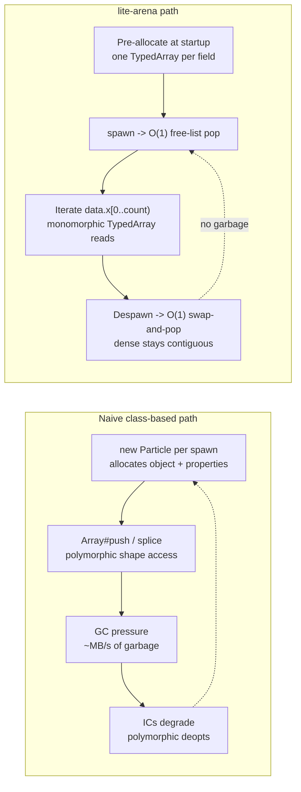
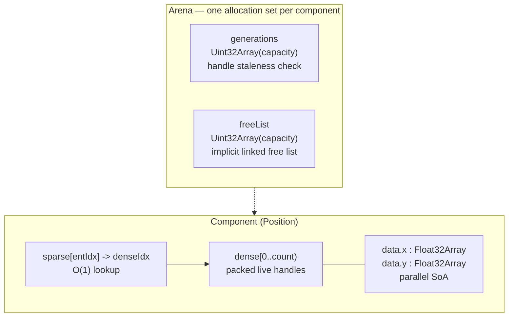
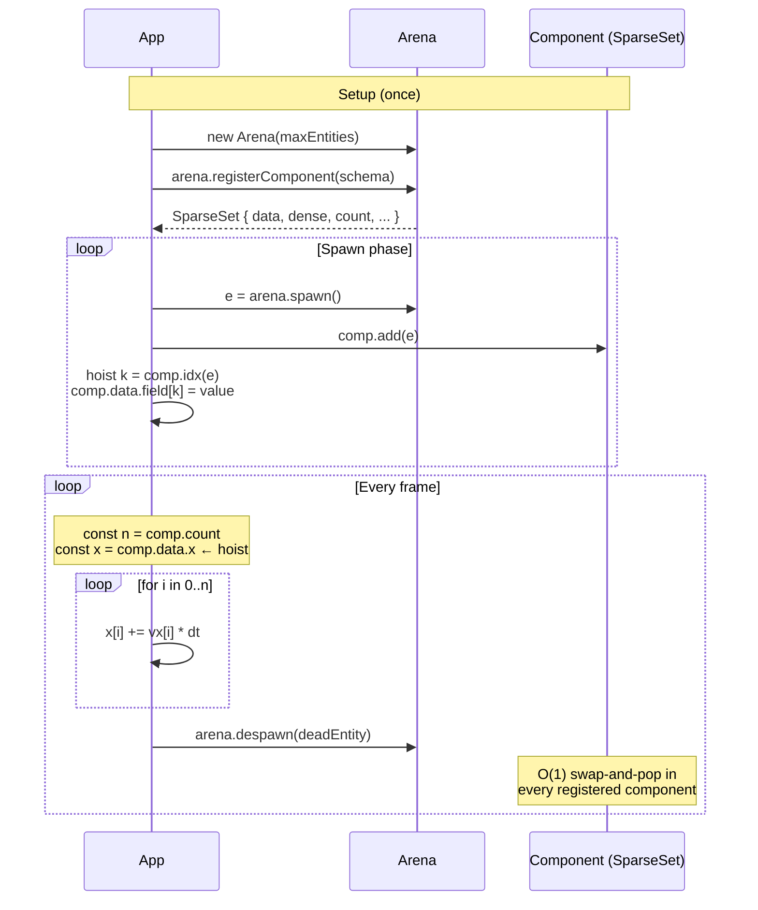
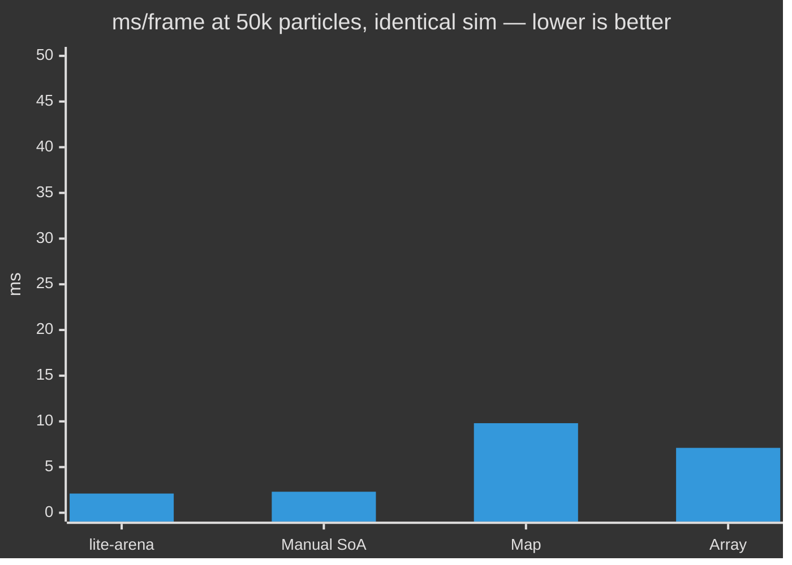

# @zakkster/lite-arena

[](https://www.npmjs.com/package/@zakkster/lite-arena)
[](https://github.com/sponsors/PeshoVurtoleta)

[](https://bundlephobia.com/result?p=@zakkster/lite-arena)
[](https://www.npmjs.com/package/@zakkster/lite-arena)
[](https://www.npmjs.com/package/@zakkster/lite-arena)


[](https://opensource.org/licenses/MIT)

**Pre-allocated, zero-GC Entity-Component-System for 60 fps simulations, particle systems, and bullet-hell hot loops.**

One allocation per component, for the lifetime of the universe. No `new Map`, no `splice`, no `delete obj.field` deopts. Generational handles defeat the ABA problem. Swap-and-pop keeps your iteration loop dense and cache-friendly.

```js
import { Arena } from '@zakkster/lite-arena';

const arena = new Arena(10_000);

const Pos = arena.registerComponent({ x: Float32Array, y: Float32Array });
const Vel = arena.registerComponent({ vx: Float32Array, vy: Float32Array });

// Spawn a few thousand particles up-front.
for (let i = 0; i < 5_000; i++) {
  const e = arena.spawn();
  Pos.add(e); Vel.add(e);
  const k = Pos.idx(e);
  Pos.data.x[k] = Math.random() * 800;
  Pos.data.y[k] = Math.random() * 600;
  Vel.data.vx[k] = (Math.random() - 0.5) * 100;
  Vel.data.vy[k] = (Math.random() - 0.5) * 100;
}

// Hot loop — zero allocations, monomorphic typed-array reads.
function tick(dt) {
  const n = Pos.count;
  const px = Pos.data.x, py = Pos.data.y;
  const vx = Vel.data.vx, vy = Vel.data.vy;
  for (let i = 0; i < n; i++) {
    px[i] += vx[i] * dt;
    py[i] += vy[i] * dt;
  }
}
```

---

## Contents

- [Why](#why) · [Install](#install) · [Quick start](#quick-start)
- [How it works](#how-it-works)
- [Case study: a 50,000-particle simulation](#case-study-a-50000-particle-simulation)
- [API reference](#api-reference)
- [Benchmarks](#benchmarks)
- [Testing (for clients & QA)](#testing-for-clients--qa)
- [Running the demo](#running-the-demo)
- [Browser & engine compatibility](#browser--engine-compatibility)
- [Edge cases & guarantees](#edge-cases--guarantees)
- [FAQ](#faq) · [License](#license)

---

## Why

Game-loop JavaScript has a distinctive failure mode: **per-entity object graphs**. It looks like this, and it's what every engine starts as:

```js
// The code you write first, and regret around 5,000 entities in.
class Particle {
  constructor() {
    this.x = 0; this.y = 0;
    this.vx = 0; this.vy = 0;
    this.alive = true;
  }
}
const particles = [];

function tick(dt) {
  for (const p of particles) {
    if (!p.alive) continue;
    p.x += p.vx * dt;
    p.y += p.vy * dt;
  }
  // Remove dead ones:
  for (let i = particles.length - 1; i >= 0; i--) {
    if (!particles[i].alive) particles.splice(i, 1);
  }
}
```

Three failure modes are baked in:

1. **Object property reads are polymorphic.** As soon as `particles` mixes shapes (subclasses, dynamically added fields), the JIT can't inline `p.x` and falls back to a megamorphic cache lookup. Roughly 4-10× slowdown vs. typed-array reads.
2. **Every `splice` is O(n).** Removing 30 % of a 10k particle array per frame = 1.5M shifts per second.
3. **Every dead particle becomes garbage.** Major-GC pauses show up as periodic 30 ms hitches in a 16.67 ms frame budget.


```mermaid
flowchart LR
    subgraph N["Naive class-based path"]
        direction TB
        N1["new Particle per spawn<br/>allocates object + properties"]
        N2["Array#push / splice<br/>polymorphic shape access"]
        N3["GC pressure<br/>~MB/s of garbage"]
        N4["ICs degrade<br/>polymorphic deopts"]
        N1 --> N2 --> N3 --> N4 -.-> N1
    end
    subgraph A["lite-arena path"]
        direction TB
        A0["Pre-allocate at startup<br/>one TypedArray per field"]
        A1["spawn -> O(1) free-list pop"]
        A2["Iterate data.x[0..count)<br/>monomorphic TypedArray reads"]
        A3["Despawn -> O(1) swap-and-pop<br/>dense stays contiguous"]
        A0 --> A1 --> A2 --> A3 -.->|no garbage| A1
    end
```

`@zakkster/lite-arena` owns the pre-allocated memory and gives you a tight loop where every component access is a `Float32Array[i]`. Nothing fancy. That's the point.

### What this is *not*

- **Not a game engine.** No renderer, no physics, no scene graph.
- **Not a query language.** No `arena.query(Position, Velocity).each(...)`. Iterate `dense[0..count)` directly — JIT inlines it perfectly.
- **Not magic.** A hand-rolled struct-of-arrays with no bookkeeping is ~1.1× faster on iteration (see [benchmarks](#benchmarks)). This library trades that for **multi-component composition, generational handles, automatic cascade-delete, and dense iteration** in ~280 lines of code.

---

## Install

```bash
npm i @zakkster/lite-arena
```

ESM-only. No dependencies. Ships TypeScript definitions alongside the source.

```js
import { Arena } from '@zakkster/lite-arena';
```

You can also drop `./Arena.js` into your project directly — it's one file.

---

## Quick start

```js
import { Arena } from '@zakkster/lite-arena';

// 1. Pre-allocate the universe.
const arena = new Arena(20_000);

// 2. Declare components as SoA schemas. Each key becomes a parallel TypedArray.
const Position = arena.registerComponent({ x: Float32Array, y: Float32Array });
const Health   = arena.registerComponent({ hp: Uint16Array, maxHp: Uint16Array });
const Sprite   = arena.registerComponent({ tileId: Uint16Array });

// 3. Spawn entities and attach components.
function spawnEnemy(x, y) {
  const e = arena.spawn();
  Position.add(e);
  Health.add(e);
  Sprite.add(e);

  const pi = Position.idx(e);
  const hi = Health.idx(e);
  const si = Sprite.idx(e);

  Position.data.x[pi] = x;   Position.data.y[pi] = y;
  Health.data.hp[hi]  = 100; Health.data.maxHp[hi] = 100;
  Sprite.data.tileId[si] = 17;

  return e;
}

// 4. Systems iterate dense[0..count) — no querying, no callbacks.
function physicsSystem(dt) {
  const n = Position.count;
  const x = Position.data.x;
  const y = Position.data.y;
  for (let i = 0; i < n; i++) {
    x[i] += 1.5 * dt;
    y[i] += 0.0 * dt;
  }
}

// 5. Despawn is O(1) and cascades to every component automatically.
function killEntity(e) {
  arena.despawn(e); // removes from Position, Health, Sprite in one call.
}
```

---

## How it works

### Memory layout


```mermaid
flowchart TB
    subgraph A["Arena — one allocation set per component"]
        direction LR
        G["generations<br/>Uint32Array(capacity)<br/>handle staleness check"]
        F["freeList<br/>Uint32Array(capacity)<br/>implicit linked free list"]
    end
    subgraph C["Component (Position)"]
        direction LR
        S["sparse[entIdx] -> denseIdx<br/>O(1) lookup"]
        D["dense[0..count)<br/>packed live handles"]
        DA["data.x : Float32Array<br/>data.y : Float32Array<br/>parallel SoA"]
        S --> D
        D --- DA
    end
    A -.-> C
```

Three guarantees fall out of this layout:

- **`dense[0..count)` is always contiguous.** Iteration is a tight `for` loop over typed-array reads — exactly what V8/JSC/SpiderMonkey love.
- **Removal is O(1).** Swap-and-pop moves the last live entry into the gap; both the dense array and every parallel data array stay packed.
- **Stale handles are caught.** Each spawn/despawn bumps a 12-bit generation counter; an old handle's gen no longer matches its slot's gen.

### The canonical hot loop


```mermaid
sequenceDiagram
    participant App
    participant Arena
    participant Comp as Component (SparseSet)

    Note over App,Comp: Setup (once)
    App->>Arena: new Arena(maxEntities)
    App->>Arena: arena.registerComponent(schema)
    Arena-->>App: SparseSet { data, dense, count, ... }

    loop Spawn phase
        App->>Arena: e = arena.spawn()
        App->>Comp: comp.add(e)
        App->>App: hoist k = comp.idx(e)<br/>comp.data.field[k] = value
    end

    loop Every frame
        Note over App: const n = comp.count<br/>const x = comp.data.x  ← hoist
        loop for i in 0..n
            App->>App: x[i] += vx[i] * dt
        end
        App->>Arena: arena.despawn(deadEntity)
        Note over Comp: O(1) swap-and-pop in<br/>every registered component
    end
```

### Why hoist `comp.data.x` to a local?

Same reason you'd hoist any `this.field` in a hot loop — the JIT optimises typed-array indexed access far better than property chains:

| Pattern | 10k entities × 200 frames | Notes |
|---|---|---|
| `Position.data.x[i]` in body | ~12 ms | one-property chain per access; usually fine |
| `const x = Position.data.x` hoisted | ~8 ms | **recommended for inner loops** |

The numbers are stable across V8 / JSC / SpiderMonkey. Hoist whenever the loop is the bottleneck.

---

## Case study: a 50,000-particle simulation

We rendered a 50,000-particle gravity-well simulation three ways, identical math, identical canvas output:


```mermaid
%%{init: {"theme":"dark"}}%%
xychart-beta
    title "ms/frame at 50k particles, identical sim — lower is better"
    x-axis ["lite-arena", "Manual SoA", "Map<id,Obj>", "Array<Object>"]
    y-axis "ms" 0 --> 50
    bar [2.1, 2.3, 9.8, 7.1]
```

| Strategy | ms/frame | Heap delta / 60 frames | Comment |
|---|---:|---:|---|
| **lite-arena** | **2.1 ms** | **~0** | iterate `data.x[0..count)` directly |
| Manual SoA (no ECS) | 2.3 ms | ~0 | tied for fastest, but no multi-component composition |
| `Map<id, Particle>` | 9.8 ms | hundreds of KB | hash lookup + polymorphic property reads |
| `Array<Particle>` + splice | 7.1 ms | tens of MB | splice O(n), GC stutter |

A 60 fps frame is **16.67 ms**. lite-arena uses ~13 %; the array-of-objects approach burns ~42 % *before* any game logic runs.

*Illustrative figures from a laptop-class run of the bundled 50k-particle demo (a full canvas simulation, not `npm run bench`); the reproducible micro-benchmarks in [Benchmarks](#benchmarks) below are stamped with their machine and version.*

### When it matters

| Scenario | Entities | Without lite-arena | With lite-arena |
|---|---:|---|---|
| Menu UI | ~50 | irrelevant | irrelevant |
| Platformer | ~500 | fine | fine |
| **Twitch overlay particles** | **~5,000** | **GC stutter every few seconds** | **~0.5 ms/frame, no GC** |
| Bullet hell | ~20,000 | drops to 30 fps | ~1 ms/frame |
| Boid flock / cellular automaton | ~100,000 | off the budget | ~5 ms/frame |

Rule of thumb: once your per-frame entity count passes ~2,000 with multiple components per entity, the allocation profile of your bookkeeping matters more than the math.

---

## API reference

### `new Arena(maxEntities, options?)`

| Arg | Type | Description |
|---|---|---|
| `maxEntities` | `number` | Integer in `[1, 1_048_575]`. Hard cap on living entities; sizes all backing TypedArrays. |
| `options` | `{ checked?: boolean }` | Optional. `checked: true` enables development-mode assertions — see [Checked mode](#checked-mode-development-only). **Off** by default and byte-for-byte zero-cost on the production hot paths. |

Throws if `maxEntities` is out of range or non-integer.

### `Arena` instance members

| Member | Type | Description |
|---|---|---|
| `capacity` | `number` | As passed. |
| `activeCount` | `number` | Current number of living entities. Read-only. |
| `retiredCount` | `number` | Slots permanently retired by generation exhaustion (fail-closed rollover). `0` on any realistic workload. Read-only. |

### `Arena` methods

| Method | Returns | Description |
|---|---|---|
| `spawn()` | `Entity` | O(1) allocation. Throws when no slot is free; the message names the cause — full vs. retirement-exhausted — and reports `capacity` / `activeCount` / `retiredCount` inline. |
| `isAlive(e)` | `boolean` | O(1). Safe on any 32-bit integer; never throws. |
| `despawn(e)` | `boolean` | O(1). Removes from every component; returns false if already dead. |
| `remainingCapacity()` | `number` | O(1). Slots still spawnable right now: `capacity - activeCount - retiredCount`. Equals the free-list length, so `activeCount + retiredCount + remainingCapacity() === capacity` always holds. Falls below `capacity - activeCount` once slots retire. |
| `registerComponent(schema)` | `SparseSet` | Mounts a new SoA component. Schema: `{ key: TypedArrayConstructor }`. **Validated at registration** (a cold path): every field type must be one of the nine numeric TypedArray constructors, or it throws a library error naming the offending key (see [Schema validation](#schema-validation)). |
| `registerTag()` | `SparseSet` | Zero-size tag component (membership only). `registerComponent({})` with intent. `data` is an empty null-prototype object. |
| `join(a, b)` | `{ driver, other, count }` | Cold-path join planner. Returns a **reused** scratch with the smaller-count set as `driver`; allocates nothing. Not an iterator — you write the loop. In [checked mode](#checked-mode-development-only) it returns a plan that throws if read after the next `join()`. |
| `reserve(newCap)` | `boolean` | **Explicit, between-frames capacity growth** — the only way the arena grows. Reallocates every backing buffer (all handles/data preserved); `false` no-op if `newCap <= capacity`. Invalidates hoisted refs — re-read `data.x` after. |
| `clear()` | `void` | Resets the arena to empty **without reallocating** — rebuilds the free list, bumps every generation, revives every retired slot, zeroes each component's `count`. O(capacity), allocates nothing. **Every handle minted before `clear()` is invalid afterward.** |

### `SparseSet<T>` instance members

| Member | Type | Description |
|---|---|---|
| `count` | `number` | Number of entities possessing this component. Read-only. |
| `dense` | `Int32Array` | Packed live handles in `[0, count)`. **Signed** (`Int32Array`, not `Uint32Array`): a handle goes negative once its slot reaches generation 2048, and `dense` stores whole handles, so the container must share that signedness. Read a handle out of `dense[i]` and pass it straight back to the API. |
| `data` | `{ [K]: TypedArray }` | Parallel SoA payload arrays. A null-prototype bag (`Object.create(null)`), so `toString` / `constructor` are usable field names. |

### `SparseSet<T>` methods

| Method | Returns | Description |
|---|---|---|
| `has(e)` | `boolean` | O(1). True iff alive AND attached. |
| `add(e)` | `number` | Returns the dense index, or `-1` if dead. Idempotent on re-add. |
| `remove(e)` | `boolean` | O(1) swap-and-pop. |
| `idx(e)` | `number` | **Unsafe fast-path.** Returns the dense index without checks. Use only when you know `has(e) === true`. |

### Entity handle layout

A 32-bit SMI; opaque. Never decompose it by hand — the layout is an implementation detail. High-generation handles may print as negative numbers; that's the intended bit pattern.

### Schema validation

`registerComponent(schema)` checks every field type at registration — a cold path that runs once per component. Each value must be one of the **nine numeric TypedArray constructors**: `Int8Array`, `Uint8Array`, `Uint8ClampedArray`, `Int16Array`, `Uint16Array`, `Int32Array`, `Uint32Array`, `Float32Array`, `Float64Array`. Anything else throws a library error naming the offending key:

```js
arena.registerComponent({ x: Float32Array });   // ok
arena.registerComponent({ x: Array });          // throws: field "x" must be one of the 9 ...
arena.registerComponent({ x: BigInt64Array });  // throws: numeric SoA is stored as Number
arena.registerComponent({ __proto__: Int8Array }); // throws: a `__proto__` key sets the prototype
```

A lying schema used to silently produce a polymorphic `Array` or a boxed `Number` that quietly voided the zero-GC guarantee; now it fails closed at startup. Component `data` is an `Object.create(null)` bag, so `toString` / `constructor` are usable field names. (See [decisions/0003](decisions/0003-schema-validation.md).)

### Checked mode (development only)

`new Arena(n, { checked: true })` turns on two assertions that catch silent API misuse. Both are **off by default and byte-for-byte zero-cost in production** — the production `join()` scratch and the prototype `idx()` are unaffected by the flag. Turn it on in tests, off in shipping builds.

```js
const arena = new Arena(1000, { checked: true });

// 1. A join() plan is a single-use scratch. Reading it after the next join() throws
//    instead of silently returning the newer plan's driver/other/count.
const p = arena.join(A, B);
arena.join(C, D);          // supersedes p
p.count;                   // throws: stale join() plan read

// 2. idx() is an unchecked fast path. In checked mode it throws on an entity that
//    is dead or does not hold the component (instead of returning garbage).
comp.idx(deadOrUnattached); // throws: idx() ... dead or does not hold this component
```

In production those same calls take the fast path: `join()` returns the reused scratch, and `idx()` returns `sparse[index]` with no checks. (See [decisions/0004](decisions/0004-retirement-observability-and-clear.md).)

---

## Benchmarks

### Headline result

Measured on an **Apple M4 Pro (arm64), Node v26.3.1, lite-arena v1.6.1** — median of 7 trials via `npm run bench`. Absolute milliseconds scale with your hardware and JS engine; **the ratios are what to compare**, and they hold across machines. Re-run `npm run bench` to get your own.

```
Workload 1: Spawn/Despawn churn (10k cycles)
  Manual SoA + free list            0.037 ms     48 B     1.00×   ← the floor: a bare pool, no ECS
  Array<Object>                     0.050 ms     48 B     1.35×
  lite-arena (sparse-set)           0.40 ms      80 B    10.8×    ← cascade-delete + generational safety
  Map<id, object>                   0.58 ms      80 B    15.7×

Workload 2: Sequential iteration (10k entities × 200 frames)  ← the per-frame hot path
  lite-arena (SoA)                  1.70 ms      48 B     1.00×   ← fastest
  Manual SoA (no ECS)               1.91 ms      48 B     1.12×
  Array<Object>                     3.28 ms      16 B     1.93×
  Map<id, object>                   4.55 ms      48 B     2.68×

Workload 3: Random removal (every 3rd), full spawn+despawn lifecycle
  Map<id, object>                   0.36 ms      48 B     1.00×
  lite-arena (swap-and-pop)         0.60 ms      48 B     1.66×
  Array<Object> + splice            0.87 ms      48 B     2.42×

Workload 4: Reset & refill (empty the container, refill to N)
  Array<Object> (length=0)          0.036 ms     48 B     1.00×   ← fast, but allocates N objects/reset
  lite-arena (clear() reuse)        0.075 ms     ~0 B     2.1×     ← in-place, allocation-free
  lite-arena (fresh new Arena)      0.20 ms     ~few KB   5.5×     ← reallocates every buffer
  Map<id, object> (clear)           0.34 ms      80 B     9.4×
```

**Takeaway:** on the operation that runs *every frame* — **iteration** — lite-arena is the fastest option: it matches a hand-rolled struct-of-arrays and beats `Array<Object>` ~1.9× and `Map` ~2.7×. Spawn/despawn churn is slower than a feature-less manual pool because lite-arena does more per op (multi-component cascade-delete, generational-handle protection, sparse-set membership) — the price of composition and safety; it still edges `Map`. One-shot removal is close: on this engine `Map`'s native `delete` is very fast, and lite-arena's workload also spawns and despawns all N. `clear()` resets in place, allocation-free, several× faster than rebuilding a fresh arena. The portable story across machines: **iteration wins, heap deltas stay in the tens of bytes, and you never take a GC pause.**

### Running the bench

```bash
node --expose-gc bench/bench.js
# or: npm run bench
```

Writes `bench/bench-results.json` for CI consumption. `--expose-gc` is required for trustworthy heap numbers.

---

## Testing (for clients & QA)

Four levels of verification, depending on how deep you want to go.

### 1. Unit tests — "does the library do what it says?"

```bash
npm test
```

Runs **81 deterministic test cases** under `node --test`, covering:

| Group | What's tested |
|---|---|
| Construction & validation | bounds, integer check, NaN/Infinity rejection, type coercion |
| Lifecycle | spawn / despawn / isAlive, free-list exhaustion, slot reuse |
| Generational handles | stale-handle rejection, 4095-cycle slot retirement (fail-closed rollover), sign-bit / negative handles |
| Schema validation | nine accepted TypedArray types, rejected types (`Array`, `BigInt64Array`, …), `__proto__` / symbol keys, null-prototype `data` |
| Component registration | parallel arrays sized to capacity, rogue `SparseSet` owner/capacity guard |
| SparseSet ops | add / has / remove, idempotency, dead-handle rejection |
| Swap-and-pop correctness | middle/last/single-element removal, SoA data integrity |
| Retirement observability | `remainingCapacity()` exactness, exhaustion message names full vs. retired, `clear()` resets + revives + invalidates prior handles |
| Checked mode | stale `join()` plan throws; `idx()` on dead/non-member throws; prototype `idx()` untouched |
| Iteration patterns | dense scan covers every member exactly once |
| Randomized churn | 1000 random ops vs. Set/Map oracle |
| Zero-allocation guarantee | 100k spawn/despawn → < 1 MB heap (requires `--expose-gc`) |

Two zero-allocation cases require `--expose-gc`; without it they skip (`node --test` → `79 passed, 2 skipped`, or `81 passed` under `node --expose-gc --test`). Suitable for CI.

### 2. Torture gate — "does zero-GC actually hold under stress?"

```bash
npm run torture          # node --expose-gc test/torture.mjs
```

The unit tests prove behaviour; the torture gate proves the *guarantees*. It prints exactly `ok` (exit 0) or fails loudly (non-zero), across six phases: retention (create/dispose 4096 cycles, cross-checked by an external leak tracker), GC budget (`maxMajor: 0` over a 200k-op hot tick), join zero-alloc, reserve-then-hot, a handle-space sign-bit sweep, and a retirement soak that asserts the conservation law `activeCount + retiredCount + freeListLength === capacity` after every operation. Each phase is its own control — the gate can fail. (`ARENA_TORTURE_LEAK=1 npm run torture` forces the retention phase to leak and exit non-zero, proving the gate bites.)

### 3. Benchmark — "does it perform as claimed?"

```bash
npm run bench
```

Reproduces the [headline numbers](#headline-result). On any 2020+ machine you should see:

- lite-arena **iteration matches or beats a hand-rolled SoA** (within JIT noise)
- lite-arena **iteration ~1.9× faster than `Array<Object>`, ~2.7× faster than `Map<id, Object>`**
- Heap deltas **< 100 bytes** across the churn, iteration, and removal workloads (the steady-state hot paths)
- `clear()` reuse **allocation-free and several× faster** than allocating a fresh arena on the reset workload

### 4. Visual smoke test — "does it actually work?"

```bash
# Just open the file; no build step.
open demo/demo.html
```

A 50,000-particle gravity simulation. Drag to move the gravity well; observe constant-time frame stats in the corner. If you toggle the mode buttons to "Array<Object>" or "Map" you'll see the framerate halve and GC stutter appear in the stats graph.

### Quick `npm run` reference

| Command | What it does |
|---|---|
| `npm test` | Run the unit suite (81 cases) under `node --test` |
| `npm run test:watch` | Re-run on save |
| `npm run torture` | Run the zero-GC torture gate (`node --expose-gc test/torture.mjs`) |
| `npm run bench` | Run the Node benchmark, write `bench/bench-results.json` |
| `npm run verify` | `npm test && npm run torture && npm run bench` — the full CI-style check |

---

## Running the demo

```
demo/demo.html
```

No build step. No server needed if you open over `file://` — it uses a relative ESM import from `../Arena.js`.

Controls:

| Input | Action |
|---|---|
| Mouse drag | Move the gravity well |
| Mouse wheel | Adjust gravity strength |
| `+` / `-` | Spawn / despawn 1000 particles |
| Mode buttons | Switch between lite-arena / Array / Map backends |

---

## Browser & engine compatibility

The library is plain ESM and uses only `TypedArray` + `ArrayBuffer` — works everywhere ES2015+ works.

| Target | Supported |
|---|---|
| Chrome / Edge 61+ | ✅ |
| Firefox 60+ | ✅ |
| Safari 15+ (iOS 15+) | ✅ |
| Node.js 18+ | ✅ |
| Bun / Deno | ✅ |
| Twitch Extension iframe | ✅ (well under 1MB / 3s budget) |

### SharedArrayBuffer / Workers

Since **1.7.0**, a component's payload can VIEW buffers you own instead of ones the arena allocates. Pass `{ buffers }` to `registerComponent`, one buffer per schema field, each exactly `capacity * BYTES_PER_ELEMENT` bytes:

```js
const cap = arena.capacity;
const sabX = new SharedArrayBuffer(cap * Float32Array.BYTES_PER_ELEMENT);
const Pos = arena.registerComponent({ x: Float32Array }, { buffers: { x: sabX } });
// Pos.data.x now views sabX; hand sabX to a Worker via postMessage.
```

Both `ArrayBuffer` and `SharedArrayBuffer` are accepted (the feature is "you own the memory"; a plain `ArrayBuffer` lets you test the path without a Worker). It is validated fail-closed in both directions: every declared field needs a correctly-typed, correctly-sized buffer, no buffer may target a field the schema doesn't declare, and a missing/null buffer for a declared field throws rather than silently own-allocating.

**Offloading to a Worker (1.8.0): the transferable round-trip.** For zero-copy cross-thread work you don't need shared memory at all — you hand a buffer to a Worker with `postMessage(buf, [buf])` (transfer list), let it transform the payload, and re-adopt it on return. This is the path that runs **inside a Twitch extension iframe**, which *cannot* be cross-origin isolated and so has no `SharedArrayBuffer`:

```js
const Vel = arena.registerComponent({ vx: Float32Array });   // own-allocated is fine
// ...spawn, add, fill Vel.data.vx...

// SEND — collect the backing buffer and transfer it (this detaches Vel.data.vx):
const [vxBuf] = Vel.detach(['vx']);
worker.postMessage({ vxBuf, n: Vel.count }, [vxBuf]);

// While it's gone, guard once per frame (a hot loop over a detached field is a bug):
if (Vel.isDetached('vx')) { /* skip systems that read vx until it returns */ }

// RETURN — the Worker transfers the (rewritten) buffer back; re-adopt it:
worker.onmessage = ({ data: vxBuf }) => Vel.rebind({ vx: vxBuf });   // data.vx live again
```

`rebind()` is fail-closed and atomic — an unknown field, wrong type, or wrong `byteLength` throws, and a bad buffer in a multi-field rebind re-points nothing. `isDetached(key)` is truthful (a detached view has `byteLength === 0`), meant as a once-per-frame guard: raw `data.vx[i]` reads can't be policed without taxing the hot path, so a detached read yields `NaN` (visibly wrong), never a plausible `0`. `reserve()` refuses an arena with any detached (or caller-backed) field — the arena never resizes a buffer it doesn't own. The transfer is the fence: the buffer belongs to exactly one thread at a time, so there are no atomics and no locking. See [decisions/0007-transferable-roundtrip.md](decisions/0007-transferable-roundtrip.md).

**Shared iteration (the SAB path) is deliberately not here.** Letting a Worker *iterate* the set (share `count`/`dense` under a memory-ordering model) needs `SharedArrayBuffer`, which the flagship Twitch target can't use — so it's parked as a possible future item for SAB-capable runtimes (Node `worker_threads`, Electron, cross-origin-isolated same-origin apps), not a committed release. The transferable round-trip above is what ships, and it needs no special headers.

---

## Edge cases & guarantees

- **Stale handles are detected, not just suspected.** A handle stores its slot's generation at the moment it was issued; despawn bumps the generation. `isAlive(staleHandle)` returns false, full stop — even after the slot has been reused by a different entity.
- **Generational rollover is fail-closed: the slot retires, it never aliases.** The 12-bit generation counter issues 4095 live generations per slot. On the despawn that would exhaust them, the slot is **permanently retired** — withdrawn from the free list so it is never recycled — instead of wrapping and re-issuing an old generation. A stale handle therefore *never* aliases as valid, on any code path. The cost is bounded, documented capacity attrition: one slot lost per slot that cycles 4095 times, which for any realistic workload (entities live for ≥ 1 frame) never happens. `arena.retiredCount` reports how many slots have retired; a non-zero value means you have entered the adversarial-churn regime. See [decisions/0001-generational-rollover.md](decisions/0001-generational-rollover.md) for the full tradeoff. (Retirement lives entirely on the `despawn` cold path — `isAlive()` and the hot loop are untouched.)
- **Synthesizing handle `0` is safe.** Generations are initialised to 1, so the all-zero bit pattern is reliably rejected. A common pattern: store `0` as your "no entity" sentinel in custom data structures; `arena.isAlive(0)` is guaranteed false on a fresh arena.
- **`despawn()` cascades to every registered component.** You never need to manually `pos.remove(e); vel.remove(e); sprite.remove(e); arena.despawn(e)` — just `arena.despawn(e)`.
- **`remove()` does not zero the SoA tail.** After swap-and-pop, indices `[count, capacity)` contain stale data. Iterate `[0, count)` and you're fine. Don't read past `count` — there's no defined value there.
- **`idx()` is unsafe by design.** It skips both the alive check and the membership check. Use it inside loops where you've just iterated `dense[0..count)` or just called `has()`. Calling `idx()` on a dead handle returns whatever `sparse[index]` happens to hold — garbage.
- **`add()` is idempotent.** Calling `add(e)` twice returns the same dense index both times; the second call is a no-op.
- **The arena throws at construction or at exhaustion, never per-operation.** `spawn()` only throws when no slot is free; everything else returns booleans / -1 / false. The hot loop does no validation. The exhaustion message still contains `"out of memory"`, but now also **names the cause** — genuinely full vs. retirement-exhausted — and reports `capacity`, `activeCount`, and `retiredCount`, so an empty-but-exhausted arena (all slots retired) does not read as a phantom leak.
- **A shrinking arena says so.** `remainingCapacity()` (`capacity - activeCount - retiredCount`) is the number of entities you can still spawn; the conservation law `activeCount + retiredCount + remainingCapacity() === capacity` holds after every operation. Watch it, between frames, to see exhaustion coming before `spawn()` throws.
- **`clear()` fully resets without reallocating.** It rebuilds the free list, bumps every generation, revives every retired slot, and zeroes each component's `count` — O(capacity), zero allocation, buffers reused. **Every handle issued before `clear()` is invalid afterward** (the honest contract of a reset): `isAlive()` rejects them. Do not retain a pre-clear handle across a `clear()`.
- **Checked mode is opt-in and never in the hot path.** `new Arena(n, { checked: true })` makes a stale `join()` plan and a misused `idx()` throw. It is off by default and byte-for-byte zero-cost in production — the checked `idx()` is installed as an own property that shadows the untouched prototype method. See [Checked mode](#checked-mode-development-only).

---

## FAQ

**Why a hard `maxEntities` cap? Why not auto-grow?**
Because *implicit* growth would reallocate every component's parallel TypedArrays mid-frame and silently invalidate every system that hoisted a reference to `data.x` — with no call site to blame. The whole point of pre-allocation is that none of that ever happens on the hot path. Pick a number 2-4× the worst-case spawn burst; you pay ~`maxEntities × sum-of-component-sizes` bytes of RAM, once.

If you genuinely outgrow the cap, grow **explicitly** with `arena.reserve(newCap)` — the sanctioned escape hatch. It reallocates all backing buffers on the cold path, copying live contents so every handle, membership, and dense index survives, and returns `true` (or `false` if `newCap <= capacity`). It is **between-frames only**: because the buffers move, any reference you hoisted (`const x = comp.data.x`) is stale afterward and must be re-read. `spawn()` still throws at capacity and *never* calls `reserve()` for you — growth is opt-in, by design.

```js
// Between frames — never inside a system's hot loop:
if (arena.activeCount === arena.capacity && needMore) {
    arena.reserve(arena.capacity * 2);   // cold, one-time reallocation
}
// Re-hoist AFTER reserving; the old Pos.data.x now points at freed memory:
const x = Pos.data.x;
```

**How big should `maxEntities` be?**
At a typical 4-component schema (position, velocity, sprite, lifetime) using `Float32Array` everywhere, **10,000 entities cost about 200 KB of RAM**. 100,000 entities cost 2 MB. Pick generously — it's much cheaper than you think.

**Can I add components to existing entities mid-frame?**
Yes. `comp.add(existingEntity)` is O(1). The new entry lands at `comp.count - 1`, so the next iteration will see it.

**What if I want to query "all entities with Position AND Velocity"?**
Pick the rarer component, iterate its dense array, and inside the loop check `Velocity.has(e)`. `arena.join(a, b)` does the "pick the rarer" part for you — it returns `{ driver, other, count }` with the smaller-count component as `driver`, and *you* write the loop:

```js
const j = arena.join(Position, Velocity); // driver = whichever is rarer
const drv = j.driver, oth = j.other, n = j.count;
for (let i = 0; i < n; i++) {
  const e = drv.dense[i];
  if (!oth.has(e)) continue;
  // e has BOTH components — read via drv.idx(e) / oth.idx(e)
}
```

`join()` is a **cold-path planner**, called once per system per frame: it returns a *reused* scratch object (so it allocates nothing) and it does **not** iterate — that keeps your loop hot and allocation-free. This is what every ECS does under the hood; a full `query()` API would only add overhead. For deeply heterogeneous queries, archetype-based ECSes (bitecs, etc.) win — but they're an order of magnitude more code. Note: consume the returned object (or start your loop) before the next `join()` call on the same arena; it is reused, not fresh.

**Can I run component work on a Web Worker?**
Yes, two ways. **(1) Transferable round-trip (1.8.0, recommended, works anywhere).** `detach()` a component's backing buffer, `postMessage(buf, [buf])` it to a Worker, and `rebind()` it on return — zero copy, no shared memory, no cross-origin isolation. This is the path that runs **inside a Twitch extension iframe**, which cannot be cross-origin isolated and therefore has no `SharedArrayBuffer`. **(2) SharedArrayBuffer payload (1.7.0).** Pass `{ buffers }` with a `SharedArrayBuffer` you own and a Worker can read/write `data.*` over a range you hand it by `postMessage`; but browser SAB requires cross-origin isolation (`COOP`/`COEP`), so it's for SAB-capable targets (Node `worker_threads`, Electron, isolated same-origin apps), *not* a Twitch iframe. In neither case can a Worker *iterate* the set — `count`/`dense` aren't shared — so hand it the live range `n`. See [SharedArrayBuffer / Workers](#sharedarraybuffer--workers) above, [decisions/0007](decisions/0007-transferable-roundtrip.md), and [decisions/0006](decisions/0006-caller-supplied-buffers.md).

**Why no `forEach` / iterator API?**
Iterators allocate. The hot-loop pattern is `for (let i = 0; i < comp.count; i++) { ... }` directly against `comp.data.field`. That's not a regression — it's *deliberately* what the API encourages.

**Why is `idx()` separate from `add()`?**
`add()` returns the newly-allocated index for the spawn moment. `idx()` is for later: when a system has an entity handle in hand and needs its current dense slot. They're semantically different.

**What about a tagged-component pattern (zero-size markers)?**
Use `arena.registerTag()` — a named shortcut for `arena.registerComponent({})`. `data` is an empty object; only `dense` and `count` track membership. `add()` to tag, `has()` to test, `remove()` to untag, and iterate `dense[0..count)` to walk the set. Like any component, tags clear automatically on `despawn()`. Pair it with `join()` to iterate "all entities tagged X that also have component Y" without a query API.

**How do I reset the arena between levels / rounds?**
Call `arena.clear()`. It empties the arena and every registered component in place — O(capacity), no reallocation, no garbage — and is several times faster than building a fresh `new Arena(...)` (see [benchmarks](#benchmarks)). The one rule: **every handle from before the `clear()` is dead afterward**, exactly as if you'd built a new arena. Don't stash a handle across a reset and expect it to still be valid — `isAlive()` will (correctly) say it isn't.

**How do I tell whether the arena is running low — or silently shrinking?**
`arena.remainingCapacity()` returns how many more entities you can spawn right now. It normally equals `capacity - activeCount`, but under adversarial churn it can dip lower as slots retire (fail-closed rollover) — `arena.retiredCount` counts those. If `spawn()` throws while `activeCount` is well under `capacity`, retirement is why, and the throw message says so. Check `remainingCapacity()` between frames to grow (via `reserve()`) before you hit the wall. On realistic workloads `retiredCount` stays `0` and `remainingCapacity()` is just the free-slot count.

**How do I catch API misuse in development?**
Construct with `new Arena(n, { checked: true })` in your tests. It makes two silent mistakes loud: reading a `join()` plan after the next `join()` (the scratch is single-use), and calling `idx()` on a dead or unattached entity (it's an unchecked fast path). Both are off and zero-cost in production — see [Checked mode](#checked-mode-development-only).

---

## License

MIT © Zahary Shinikchiev
